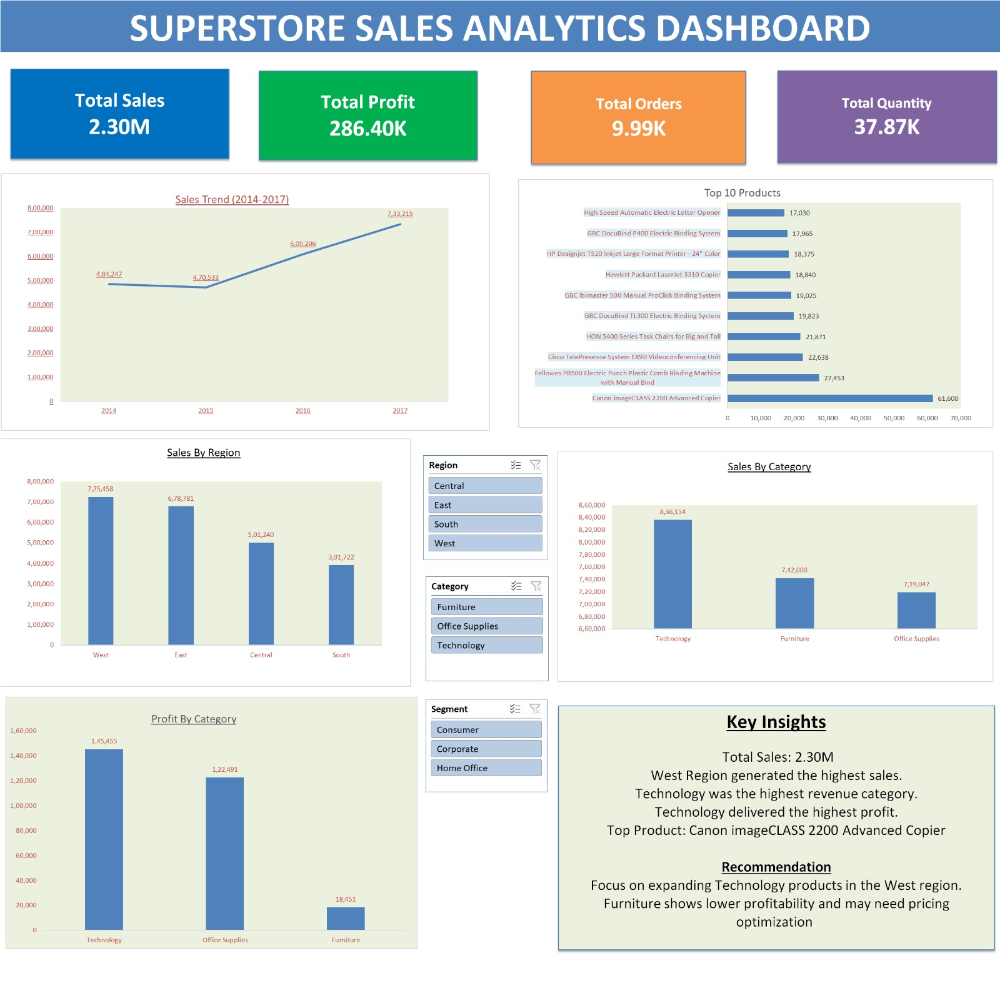

# Superstore Sales Analytics Dashboard

## Project Overview

This project is an interactive Sales Analytics Dashboard developed in Microsoft Excel. The dashboard helps analyze sales performance, profitability, regional performance, category performance, and top-selling products.

## Dashboard Preview

## Key Features

- KPI Cards (Sales, Profit, Orders, Quantity)
- Sales Trend Analysis
- Sales by Region
- Sales by Category
- Profit by Category
- Top 10 Products Analysis
- Interactive Slicers
- Business Insights & Recommendations

## Tools Used

- Microsoft Excel
- Pivot Tables
- Pivot Charts
- Slicers
- Dashboard Design

## Key Insights

- Total Sales: 2.30M
- Total Profit: 286.40K
- West Region generated the highest sales.
- Technology was the highest revenue category.
- Technology delivered the highest profit.
- Canon imageCLASS 2200 Advanced Copier was the top-selling product.

## Business Recommendation

Technology is the strongest category, leading both sales and profit. The West region generates the highest revenue, making it a key growth area. Furniture shows lower profitability and may benefit from pricing or cost optimization.
